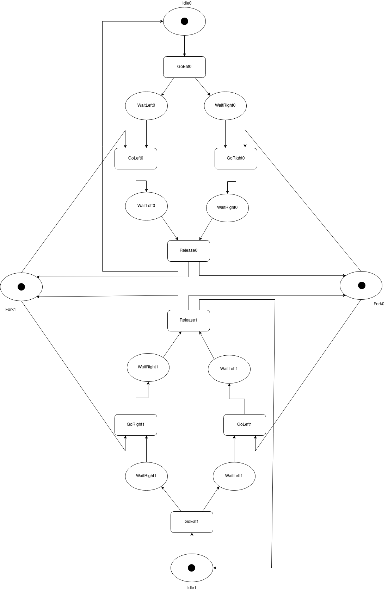
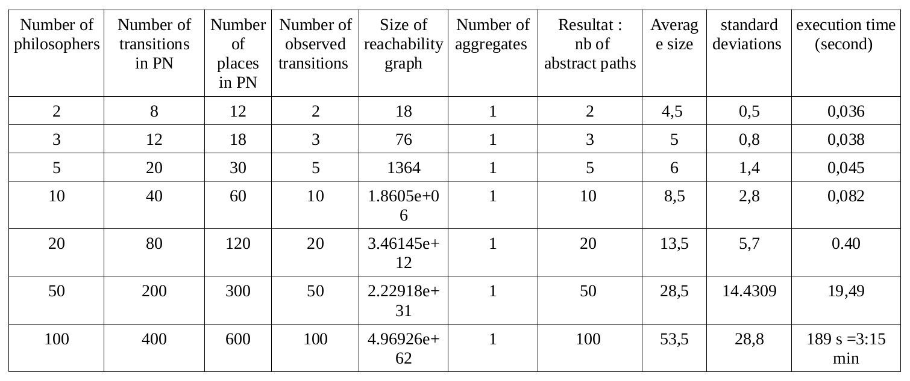

# code_source
From the description of Petri net this code is able to generate the observable paths then the abstract paths.

--- REQUIREMENTS ----------------------------------------------------
---------------------------------------------------------------------

* A (not to old) C++ compiler..
* A machine that supports 32 bit integers.

--- USE -----------------------------------------------------------
---------------------------------------------------------------------

To compile this collection of code you have to: 
-First,run the "make" command inside of the directory "buddy22" this will create/update the library libbdd.a
this directory includes the library of Binary Decision Diagrams.

-Second, run  "make" in the "parser" diractory \\ this directory is responsible for the creation of the  Petri net
from its description file  "file.net".

-Then, you run the "make" command in the principal diretory  to generate the executable file  "StructAnalysis".

-To run this executable on any exemple we hava to access the main directory and execute the command "./StructAnalysis ./Samples/file.net" 
In the paper we used the exemple file Samples/exemple.net.

--- Exemple ------------------------------------------
------------------------------------------------------

We treat the exemple of 2 dining philosophers.
The figure bellow represents the Petri Net corresponding to 2 philosophers.

  

  
  *Step1: Extract the set of unobservable transitions using the pattern. For this exemple Unobs={GoEat0, GoLeft0, GoRight0, GoEat1, GoLeft1, GoRight1}.
  *Step2: Deduce the set of observable transitions. Obs={Release0, Release1}.
  *Step3: Build the SOG (Symbolic Observation Graph) starting from the Petri Net and the set of observable transitions and build the observable paths on the fly. We get the set of observed paths {\<Release0\>,\<Release1\>}. 
  *Step4: Complete the Observable paths by unobservable transitions by making backtracking in each aggregate.
  The final result for this example is the set of abstract paths (complete paths): {\<GoEat0 GoRight0 GoLeft0 Release0\>,\<GoEat1 GoRight1 GoLeft1 GoEat0 Release1\>}

----Experimental result ----------------------------
----------------------------------------------------

we have applied our approach to the Dining philosophers problem by varying each time the number of philosophers (2,3...100 phiilosophers).
we evaluate the size of the reachability graph, the number of observed transitions , the number of aggregates found by applying our tool 
and calculate the execution time for each example.
We notice that the size of the reachability graph is increasing exponentially.
The results are summarised in the attached table. 

  

